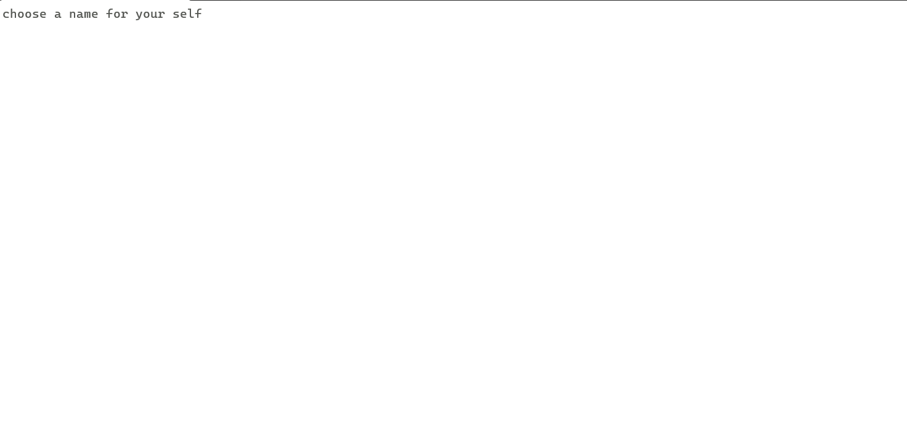
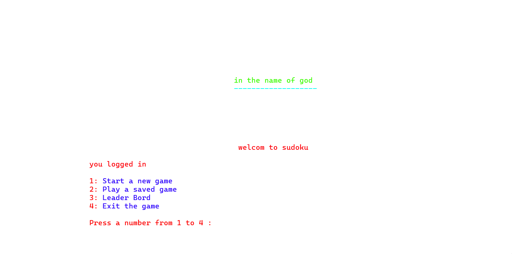
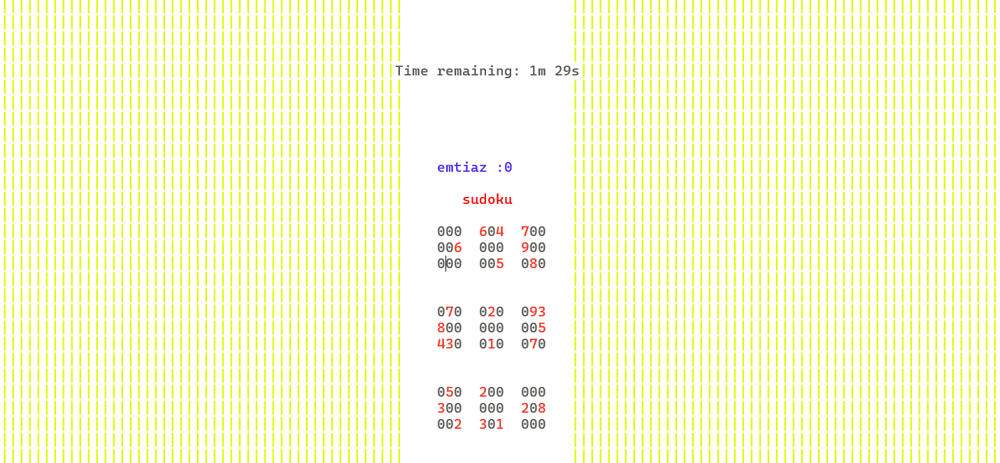

# ParsaSudoko
## project introduction
Hi guys this my firt project that i am so intrested in sharing with you.
This is **Sudoko game** written in **C++** .The game features a **dynamic timer** based on difficulty level and a **leaderboard** to track players' scores.
## Game Points
✅ **Dynamic Timer:** The game timer adjusts based on difficulty level.  
✅ **Multiple Difficulty Levels:** Players can choose from different levels.  
✅ **Leaderboard:** View scores of different players.  
✅ **Console-based Interface:** The game runs in the terminal/console.

## Pictures of the game 🎞️🎞️

This is the logging page where you should write your name  

Then you can see the main page of the game. If you want to play, enter 1 😎  

Finally, you can enjoy your game! 😍😍  

## How to run 🎊🎊
Follow these steps to run the game:  

1️⃣ Clone the repository:  

https://github.com/Parsa313-cloud/ParsaSudoko.git

git clone https://github.com/Parsa313-cloud/ParsaSudoko.git

2️⃣ Go to the project directory:

cd sudoku-game

3️⃣ Compile the project using g++:

g++ -o sudoku main.cpp

4️⃣ Run the game:

./sudoku
